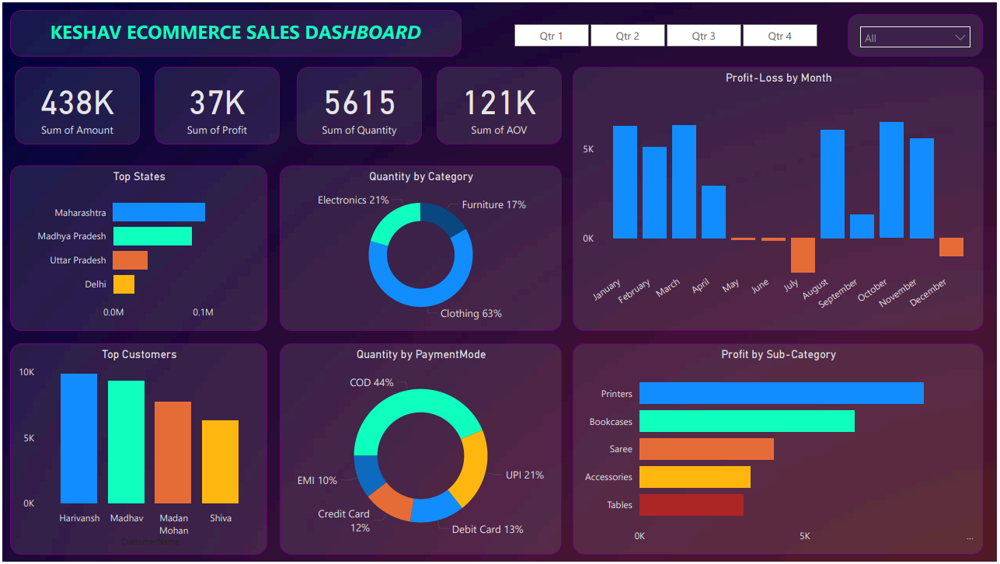

# Keshav_Ecommerce_Sales_PowerBI

Beginner Power BI learning project featuring an E-commerce sales dashboard with KPIs, slicers, and business insights.

This project is a **Power BI learning dashboard** created as part of my hands-on practice while following a guided tutorial.
It focuses on understanding Power BI fundamentals, dashboard building, and basic business insights.

# Project Overview
The goal of this project was to learn Power BI step-by-step by building a complete
E-commerce Sales Dashboard, covering data modeling, visuals, KPIs, and interactivity.

# Skills & Concepts Practiced
- Power BI interface & report building
- Data cleaning and basic data modeling
- KPI cards (Sales, Profit, Quantity, AOV)
- Category & sub-category analysis
- Payment mode and state-wise analysis
- Slicers and interactive visuals
- Business-style dashboard layout

# Files Included
- `Keshav_Ecommerce_Sales_Dashboard.pbix`
- `Dashboard_PDF_Export.pdf`

# Dashboard Highlights
- Total Sales, Profit, Quantity & AOV KPIs
- Monthly Profit/Loss trend
- Quantity by Category
- Profit by Sub-Category
- Payment Mode distribution
- Top States & Top Customers analysis
- Quarter-wise filtering using slicers

# Key Learnings
- How to structure a Power BI dashboard for business use
- How KPIs help in quick performance evaluation
- Importance of slicers for dynamic analysis
- Translating raw data into meaningful visuals

# How to Use
1. Download the `.pbix` file  
2. Open it in **Power BI Desktop**  
3. Interact with slicers and visuals to explore insights  

# Dataset Overview
The dataset contains e-commerce sales data including:
- Order amount
- Profit
- Quantity sold
- Product categories
- Customer states
- Payment modes
- Monthly and quarterly sales information

# Note
This is a **guided learning project**, recreated and customized for practice and portfolio purposes
to strengthen my Power BI fundamentals.
